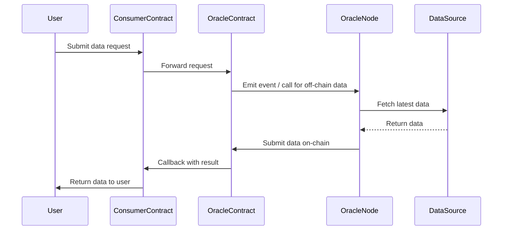

# AetherLink AElf Oracle Contract Project Documentation

## Project Overview
AetherLink-Contracts is an oracle contract system based on the aelf blockchain, covering modules such as DataFeeds, Verifiable Random Function (VRF), Automation, and Cross-chain. It supports various on-chain data and automation service scenarios.

## Project Structure Tree
```
├── contract
│   ├── AetherLink.Contracts.Oracle
│   ├── AetherLink.Contracts.DataFeeds.Coordinator
│   ├── AetherLink.Contracts.Consumer
│   ├── AetherLink.Contracts.VRF.Coordinator
│   ├── AetherLink.Contracts.Ramp
│   ├── AetherLink.Contracts.Automation
│   ├── ...
├── src
│   ├── AElf.Boilerplate.MainChain
│   ├── AElf.Boilerplate.Oracle.Launcher
│   ├── ...
├── test
│   ├── AetherLink.Contracts.Oracle.Tests
│   ├── AetherLink.Contracts.DataFeeds.Coordinator.Tests
│   ├── ...
├── protobuf
│   ├── oracle_contract.proto
│   ├── automation_contract.proto
│   ├── vrf_coordinator_contract.proto
│   ├── data_feeds_coordinator_contract.proto
│   ├── cross_chain_contract.proto
│   ├── ...
```

## Main Module Descriptions
- **DataFeeds**: On-chain data aggregation and price feeds, supporting multiple data sources.
- **VRF**: Verifiable random number generation, serving on-chain fairness requirements.
- **Automation**: Scheduled or condition-triggered on-chain automation tasks.
- **Cross-chain**: Supports data and asset interaction between aelf and other blockchains.
- **Ramp/Consumer**: Bridges between off-chain and on-chain data/assets.

## Typical DataFeeds Request Sequence

Below is a typical sequence diagram for an on-chain DataFeeds request, illustrating the interaction between the User, Consumer Contract, Oracle Contract, Oracle Node, and Data Source:



This sequence demonstrates the full lifecycle of a typical oracle data request and response on the aelf blockchain.

## Contribution Guide
1. Fork this repository and develop by module.
2. Refer to `docs/project_tracker.md` to claim tasks.
3. Ensure all tests pass before submitting a PR.
4. For detailed development workflow, see the project root rules. 